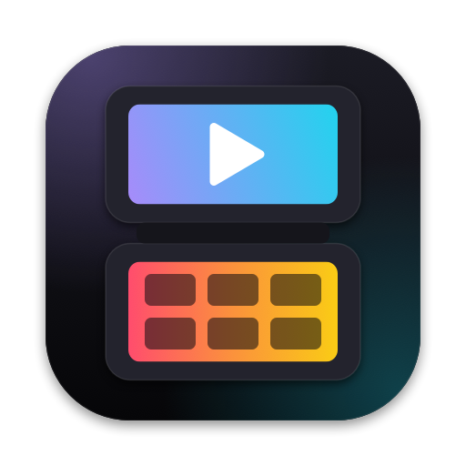
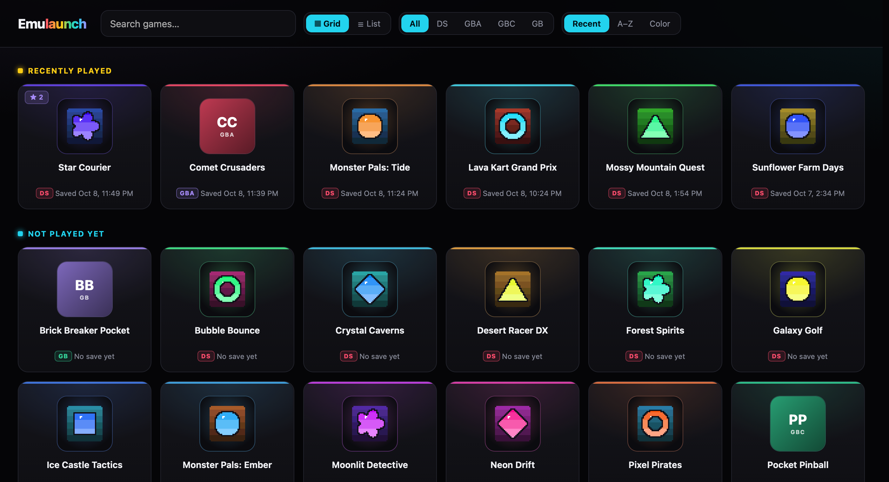
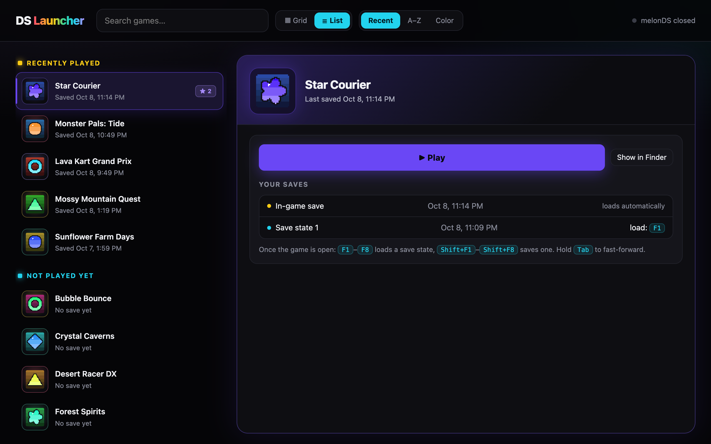

<p align="center"></p>

<h1 align="center">EmuLaun</h1>

<p align="center">A small, offline game library for macOS: your <b>Nintendo DS, Game Boy Advance, Game Boy Color and Game Boy</b> games in one place, one-click play in <a href="https://melonds.kuribo64.net/">melonDS</a> or <a href="https://mgba.io/">mGBA</a>, and a checkbox list of cheats for every game.</p>

<p align="center"></p>
<p align="center"></p>
<p align="center"><sub>Screenshots use a made-up demo library (<code>docs/make_demo.py</code>), not real games.</sub></p>

---

## Features

- **Native Mac app**: its own window and Dock icon, about 1 MB. When you quit it, nothing keeps running in the background.
- **Grid or list view.** The list view shows your games on the left and the selected game's details on the right (<kbd>↑</kbd> <kbd>↓</kbd> to browse, <kbd>Return</kbd> to play).
- **Library** with each game's real DS icon (read from the game file). Sort by **Recent**, **A–Z** or **Color**, and search.
- **Four systems**: DS games open in melonDS, and GB, GBC and GBA games open in mGBA. Each game has a system badge, and you can filter by system.
- **Per-game colors** taken from each icon and used for the card glow, the pop-up and the Play button.
- **Game pop-up** with:
  - **Play**, which starts melonDS with the game
  - your in-game save and save states with their times (F1–F8 loads a state)
  - every cheat as a checkbox, with a Favorites folder at the top, search, and "pick one" folders
- **Cheat importer** (`tools/add_games.py`). It takes games from `~/Downloads` (`.nds`, `.gba`, `.gbc`, `.gb`, or a `.zip`/`.7z` containing one), files them into the repo's `games/<system>` folder, and installs cheats:
  - **DS:** matched by game ID and header checksum against DeadSkullzJr's cheat database, written as a melonDS `.mch` file
  - **GB/GBC/GBA:** identified by CRC32 against No-Intro's checksum list, with cheats from libretro written as an mGBA `.cheats` file, plus box art
  - every game also gets an automatic Favorites list (all codes off by default) and a plain-text cheat guide
- **Fully offline** once installed.

> **No games are included.** Use backups of games you own. This repo contains only the launcher code.

## Install

Requires macOS 12+ (Intel or Apple Silicon).

```bash
git clone https://github.com/nilaip96/emulaun.git
cd emulaun
./install.sh --dock
```

The installer:

1. Installs Apple's Command Line Tools if they're missing. A system dialog appears; finish it and re-run the script.
2. Downloads **melonDS** and **mGBA** from their official GitHub releases, if they aren't already in `/Applications`. It also configures mGBA (`~/.config/mgba`): keys matching the suggested melonDS keys, auto-loading cheats, and **autosave**, which saves a resume point every ~10 seconds and on close, then picks up there next time.
3. Creates `games/DS`, `GBA`, `GBC` and `GB` plus `data/` inside the repo, then downloads the cheat data once: the DS database (about 100 MB) and libretro's Game Boy cheats and checksums (about 60 MB).
4. Builds **EmuLaun.app** from source and puts it in `/Applications`.
5. With `--dock`, adds it to your Dock.

The script is safe to re-run, and it never touches your games or saves.

## Add games

Put your game backups in `~/Downloads`, then run:

```bash
python3 tools/add_games.py            # import + install cheats
python3 tools/add_games.py --dry-run  # just show what it would do
```

- Games already in your library are skipped.
- Each game goes into its system's folder: `games/DS`, `GBA`, `GBC` or `GB`.
- Your Downloads folder is never modified.
- New games appear in EmuLaun on their own.

## Using cheats

1. Open a game's pop-up and tick the cheats you want. They apply the next time you start that game.
2. For DS games, flip the **Cheats** switch in the pop-up to ON. melonDS has one cheat switch shared by every DS game. mGBA just runs whatever is ticked. If a GB/GBA game lists a **Master Code**, tick it too.
3. "Always on" cheats just work. Others need the button combo shown, like `L+R`; press the buttons together.

Tips:

- Make a save state (`Shift+F1`) before trying a new cheat. `F1` jumps back.
- GB/GBC/GBA games autosave and resume automatically (shown as **Autosave** in the pop-up). melonDS has no autosave, so for DS games save in-game or press `Shift+F1` before closing.
- Cheats that patch game code keep running until the game restarts.
- Each game's `… - Cheat Guide.txt` (also under **Cheat guide** in the pop-up) lists every code with notes.

### Suggested melonDS keys

In melonDS, go to **Config → Input and hotkeys**. Mapping **Start → Return** and **Select → Shift** stops cheat combos like `L+R+Start` from pressing `⌘Q` by accident. Set a **fast-forward** hotkey (e.g. hold `Tab`) too.

## Run in a browser instead

```bash
python3 launcher/launcher.py   # opens http://127.0.0.1:8765, stops when you close the tab
```

## How it works

| Path | What it is |
| --- | --- |
| `launcher/launcher.py` | Tiny local server (Python standard library only, bound to `127.0.0.1`). Lists games, reads icons from DS ROM banners, launches melonDS, and reads/writes `.mch` cheat files. |
| `launcher/index.html` | The whole UI, with no external libraries. |
| `app/main.swift` | Native window (WKWebView). Starts the server on launch and stops it on quit. |
| `app/make_icon.swift` | Draws the app icon in code. |
| `app/build.sh` | Builds `EmuLaun.app`. |
| `tools/add_games.py` | Game importer and cheat installer. |
| `install.sh` | One-shot setup. |

### Folder layout

The repo defines where everything lives. Your personal files sit inside it but are gitignored, so they never get committed.

```
emulaun/
├── launcher/   app/   tools/   docs/    the code (committed)
├── install.sh  README.md
├── games/                              your library (gitignored)
│   ├── DS/   GBA/   GBC/   GB/
│   │   ├── Game.nds / .gba / .gbc / .gb     the game
│   │   ├── Game.sav                          in-game save
│   │   ├── Game.ml1–8 / Game.ss1–9           save states (melonDS / mGBA)
│   │   ├── Game.mch / Game.cheats            cheat file (melonDS / mGBA)
│   │   ├── Game.png                          box art (GB/GBC/GBA)
│   │   └── Game - Cheat Guide.txt
├── data/                               downloaded cheat databases (gitignored)
│   ├── cheats.xml                      DS
│   └── libretro-database/              GB/GBC/GBA cheats + No-Intro checksums
└── backups/                            anything you want to keep around (gitignored)
```

The installed app remembers which repo it was built from, so keep the repo where it is, or re-run `./install.sh` after moving it.

## Credits

- [melonDS](https://github.com/melonDS-emu/melonDS), the emulator
- [mGBA](https://github.com/mgba-emu/mgba), the Game Boy / GBA emulator
- [DeadSkullzJr's NDS(i) Cheat Databases](https://github.com/szTheory/NDS-Cheat-Databases) (mirror), the DS cheat codes
- [libretro-database](https://github.com/libretro/libretro-database), the GB/GBC/GBA cheats and No-Intro checksums
- [libretro-thumbnails](https://github.com/libretro-thumbnails), the box art

Cheat data and box art are downloaded at install or import time and aren't included in this repo.

## License

MIT, for the launcher code only. See [LICENSE](LICENSE).
